# Chrome Omnibox の公開コードから見たランキング調査

調査日: 2026-09-05  
Chromium の調査スナップショット: 80fbbcc27af80d78452439d7c505f5962334d043  
対象: components/omnibox/browser/ と、そのランキングに直接関係するテスト・共通部品

## 結論

結論からいうと、Chrome の Omnibox をそのまま移植することはできないっす。ただし、ランキングの設計はかなりの範囲でこちらに持ち込めます。

Chrome のソートは一つの fuzzy score ではありません。大きく分けて次の処理が連なっています。

1. 入力を EMPTY、UNKNOWN、URL、QUERY などに分類する。
2. 履歴、ブックマーク、ショートカット、検索サービス、開いているタブなどの provider が候補を作る。
3. 各 provider が候補固有の relevance を計算する。
4. 必要ならサーバー relevance や ML の予測で候補の順位を組み替える。
5. 全候補を集約し、provider 種別による demotion、重複排除、候補の統合、default 候補の選択、件数制限、グループ化を行う。

公開コードだけで再現できるのは、主に 1、2、3、5 です。検索サーバーが返す relevance、実験パラメータ、学習済み ML モデル、ユーザーごとの履歴データは、公開ソースを読んだだけでは再現できません。

このリポジトリには、すでに Chrome と相性のよい構造があります。fuzzysort による候補検索、フィールドごとの score、明示的な priority chain、連続一致、match coverage、最近開いたファイル、mtime、prior が分離されています。したがって、Chrome の巨大な provider 群を持ち込むより、Chrome から次の考え方だけを抽出して既存の契約に足すのがよさそうです。

- 候補生成と最終表示順を分ける。
- score だけでなく、候補がどのフィールドのどの位置に一致したかを信号として保持する。
- exact、contiguous、defaultable、ignored のような意味のある状態を score に潰さない。
- 同じ対象を指す候補は最後にまとめ、表示用の豊富な metadata を最良候補へ統合する。
- 非同期更新で順位がちらつかないよう、古い結果を扱うルールを明示する。

## 調査方法と公開範囲

Chromium の公式 Git リポジトリを上記の commit まで shallow clone し、provider、controller、result comparator、履歴・ブックマーク用 scorer、ユニットテストを関数単位で読みました。本文中のリンクは、その commit の Gitiles ソースです。main の最新コードは変化するので、挙動を再確認するときはスナップショットも固定してください。

Chromium の autocomplete_provider.h 自身が、relevance の表は完全な一覧ではなく、実際の挙動は chrome://omnibox/ で確認するよう説明しています。さらに components/omnibox/bug-triage.md は、chrome://omnibox のダウンロード結果には閲覧履歴などの個人情報が含まれ得るため、公開 issue に添付するものではないとしています。つまり、公開ソースは読めても、個人データを含む実行時の全候補・全信号は公開データではありません。

## 1. システム全体の構造

```mermaid
flowchart LR
    A[ユーザー入力] --> B[AutocompleteInput::Parse]
    B --> C[入力種別・keyword・page context]
    C --> D[同期 provider]
    C --> E[非同期 provider]
    D --> F[provider 内の候補生成と relevance]
    E --> F
    F --> G[AutocompleteController::AggregateNewMatches]
    G --> H{ML scoring が有効か}
    H -- はい --> I[信号注釈と ML rerank]
    H -- いいえ --> J[従来 relevance]
    I --> K[AutocompleteResult::SortAndCull]
    J --> K
    K --> L[demotion]
    L --> M[tail cull]
    M --> N[canonical URL と種別で dedupe]
    N --> O[global sort]
    O --> P[default 候補を先頭へ]
    P --> Q[group・件数制限]
    Q --> R[表示]
```



実際の非同期更新では、AutocompleteController::UpdateResult() が概ね次の順で動きます。

1. 前回結果を OldResult として退避する。
2. provider ごとの新候補を AggregateNewMatches() で追加する。
3. 有効なら MlRerank() を実行する。
4. 一度 SortAndCull() して現在の候補を整える。
5. provider ごとの不足分を前回結果から TransferOldMatches() で補う。
6. もう一度 SortAndCull() して、重複排除と件数制限をやり直す。
7. keyword 表示、action、tail prefix、統計を後処理する。

この「一度計算して終わり」ではない構造が、検索サービスの応答待ちと UI の安定性を両立させています。

### provider の契約

AutocompleteProvider は、provider ごとに候補と relevance を持たせます。同期候補は Start() の戻り時点で controller が読めます。非同期候補は更新が来たときに listener を通知します。新しい入力が始まったら Stop() で古い request を無効化し、古い request から通知してはいけません。

provider の relevance は、数値が大きいほど上位です。ただし、これは全候補を一つの意味ある確率空間に置いた数値ではありません。たとえば 1400 台は履歴・入力補完・検索履歴を競わせるための帯域で、provider 間の契約を成立させるために整数の帯を使っています。

### header にある relevance 帯域

次の表は autocomplete_provider.h の設計資料です。コメント自身が不完全な表だと明記しており、現在の実装の全候補・全 platform を表すものではありません。++ は provider 内で連続した score を割り当てる帯域、-- は下げながら割り当てる帯域、\* は時間減衰、\*\* は直近 2 日の減衰、+- は provider 内で調整する帯域です。

#### UNKNOWN input

| 候補                                 | 基準 relevance |
| ------------------------------------ | -------------: |
| keyword の完全一致                   |           1500 |
| HistoryURL の良い exact / inline     |         1410++ |
| 未訪問 intranet の HistoryURL        |         1400++ |
| primary search history、直近 2 日    |       1399\*\* |
| primary の what-you-typed            |           1300 |
| HistoryURL の what-you-typed         |         1200++ |
| substituting keyword の完全一致      |           1100 |
| primary search history、2 日より前   |         1050\* |
| HistoryURL の inexact                |          900++ |
| bookmark の prefix                   |          900+- |
| built-in                             |          860++ |
| primary の navigational suggestion   |          800++ |
| primary の suggestion                |          600++ |
| keyword の inexact                   |            450 |
| secondary の what-you-typed          |            250 |
| secondary search history             |          200\* |
| secondary の navigational suggestion |          150++ |
| secondary の suggestion              |          100++ |
| non-personalized on-device head      |           99-- |

#### URL input

| 候補                                 | 基準 relevance |
| ------------------------------------ | -------------: |
| keyword の完全一致                   |           1500 |
| HistoryURL の良い exact / inline     |         1410++ |
| 未訪問 intranet の HistoryURL        |         1400++ |
| HistoryURL の what-you-typed         |         1200++ |
| substituting keyword の完全一致      |           1100 |
| HistoryURL の inexact                |          900++ |
| built-in                             |          860++ |
| primary の what-you-typed            |            850 |
| primary の navigational suggestion   |          800++ |
| primary search history               |          750\* |
| keyword の inexact                   |            700 |
| primary の suggestion                |          300++ |
| secondary の what-you-typed          |            250 |
| secondary search history             |          200\* |
| secondary の navigational suggestion |          150++ |
| secondary の suggestion              |          100++ |
| non-personalized on-device head      |           99-- |

#### QUERY input

| 候補                                 | 基準 relevance |
| ------------------------------------ | -------------: |
| search history、直近 2 日            |       1599\*\* |
| keyword の完全一致                   |           1500 |
| substituting keyword の完全一致      |           1450 |
| primary search history、直近 2 日    |       1399\*\* |
| primary の what-you-typed            |           1300 |
| primary search history、2 日より前   |         1050\* |
| HistoryURL の inexact                |          900++ |
| bookmark の prefix                   |          900+- |
| primary の navigational suggestion   |          800++ |
| primary の suggestion                |          600++ |
| keyword の inexact                   |            450 |
| secondary の what-you-typed          |            250 |
| secondary search history             |          200\* |
| secondary の navigational suggestion |          150++ |
| secondary の suggestion              |          100++ |
| non-personalized on-device head      |           99-- |

現在の実装には、これとは別に zero-suggest 用の明示的な定数があります。suggestion_group_util.h では、verbatim 1602、clipboard 1601、most visited 1600、open tab 1500、remote zero-suggest 1400、local history 500、IPH 300 などが定義されています。header の古い表と数値が完全に一致しない箇所があるため、移植時は設計表ではなく実行される .cc とテストを優先するべきです。

## 2. 入力分類がランキングを変える

AutocompleteInput::Parse() は URL parser というより、候補の意味を決める前処理です。

- 空白だけなら EMPTY。
- URL fixup と canonicalization を試す。
- scheme、host、TLD、port、path、query、username、trailing slash、IP 形式を見る。
- http / https 以外の既知 scheme は scheme classifier に委ねる。
- 既知 TLD や port があれば URL 寄り、単語だけなら UNKNOWN 寄りにする。
- 複数の非 host component や trailing slash は URL 寄りにする。
- 曖昧な host は UNKNOWN にし、検索を default にしつつ alternate navigation の余地を残す。

この分類は単に表示ラベルを変えるだけではありません。QUERY なら検索 what-you-typed が 1300、URL なら 850、HistoryURL や search history の帯域も変わります。prevent_inline_autocomplete、keyword mode、@ の featured keyword mode も default 候補と dedupe の優先順位に入ります。

AutocompleteMatch::SetAllowedToBeDefault() の条件は次の通りです。

- @ で始まる入力では、原則として search what-you-typed 以外を default にしない。
- inline suffix が空なら default 可。
- inline を禁止している入力なら default 不可。
- 末尾 whitespace がなければ default 可。
- 末尾 whitespace がある場合は、その whitespace が inline suffix の先頭と一致するときだけ suffix から取り除いて default 可。

これは「候補が検索文字列にマッチしたか」ではなく、「Enter を押したときにユーザーの意図を変えないか」を判定しています。こちらで再利用するなら、score とは別に defaultability を持つべきです。

## 3. provider ごとの候補生成と scoring

### 3.1 HistoryQuickProvider: Chrome のローカル ranking の中心

現在の Chrome の履歴候補で最も分析しやすく、こちらへの移植価値が高いのが HistoryQuickProvider と ScoredHistoryMatch です。

#### 候補生成

URLIndexPrivateData::HistoryIDsFromWords() は次のように動きます。

1. 入力を単語へ分割する。
2. 長い単語から処理する。長い単語のほうが候補集合を狭めやすく、1 文字は高コストなので後回しにする。
3. 各単語の posting set を取り、集合積を取る。
4. 候補が多すぎる場合は typed count、visit count、last visit で rough filter し、最大 500 件程度まで絞る。
5. 残った URL と title を ScoredHistoryMatch で詳しく scoring する。
6. 上位候補を partial sort し、必要な件数だけ provider から返す。

したがって、全 URL に fuzzy score を計算しているわけではありません。先に index で候補を絞り、詳細 score は小さい集合にだけ適用します。HistoryItemsForTerms() は cursor 位置に空白を挿入した入力も試し、入力途中の単語境界を扱います。search term cache は候補集合が変わったときに無効化されます。

#### AND と word boundary

各入力 term は URL または title のどこかに現れなければ候補になりません。URL は scheme、host、path、query / ref に分けて扱われます。

- host の word boundary: 10 点
- host の mid-word: 2 点
- path: 8 点
- query / ref: 5 点
- title の先頭 num_title_words_to_allow 語: 8 点
- scheme: field trial で許可した場合だけ 10 点
- TLD: field trial で許可した場合だけ、boundary なら 10 点

mid-word は一律に捨てるわけではありません。host 内の mid-word は弱い信号として残り、title では前の term の直後に続く場合を許します。テストでは frag と ment が連続して fragment になるケースは評価され、離れた mid-word は 0 になります。

関連する重要な設計上の注意は、relevance 用の match と表示の bold 用の match が別であることです。HistoryQuick は URL 内の全 occurrence を score に使う一方、表示では入力 prefix だけを太字にする場合があります。

#### topicality

term ごとの raw score を 30 未満に cap し、次の変換を通します。

```text
raw < 10:  topicality = 0.1 * raw
raw >= 10: topicality = 1 + 2.25 * log10(0.1 * raw)
term 全体: topicality = 各 term の topicality の算術平均
```

デフォルト threshold は 0.5 です。これ未満なら候補の topicality は 0 になり、最終 score も 0 になります。

この変換の意味は、host boundary の 1 回の一致を十分に評価しつつ、同じ term が URL や title に大量に繰り返されても無限には上げないことです。コードには、term の入力順違反への penalty、最初の一致位置、query coverage、複数 term の geometric mean を検討する TODO も残っています。つまり Chrome 自身も、意味のある全 signal を一つの完成した式にしたわけではありません。

#### frequency

候補の最新訪問を最大 10 件見て、transition と recency を掛けた和を取ります。

- typed visit: 1.5
- 通常 visit: 1.0
- bookmark: bookmark value 10 が typed / 通常 value より大きければ 10
- 最新 4 日まで: recency 1.0
- 14 日: 0.7
- 31 日: 0.5
- 90 日: 0.3
- 365 日: 0.1

日数の間は区間ごとの線形補間です。訪問数が多い URL、typed visit が多い URL、最近使った URL が上がります。

#### document specificity と最終 score

同じ入力に一致する document が少ないほど specificity を上げます。デフォルトは次の対応です。

| 一致 document 数 | specificity |
| ---------------: | ----------: |
|                1 |         3.0 |
|                2 |         2.5 |
|                3 |         2.0 |
|                4 |         1.5 |
|           5 以上 |         1.0 |

中間値は次の積です。

```text
intermediate = topicality * frequency * specificity
```

その後、次の bucket 間を線形補間します。

| intermediate | final relevance |
| -----------: | --------------: |
|          0.0 |             550 |
|          1.0 |             625 |
|          9.0 |            1300 |
|    90.0 以上 |            1399 |

1399 で cap するのは、HistoryURL provider の良い inline 候補 1413 を越えないためです。provider 間の順位を成立させるための cap であって、検索の品質を直接表す上限ではありません。

#### tie-break

同じ raw score なら、次の順で比較します。

1. 一度でも typed された URL。
2. scheme や www. より内側で一致する URL。
3. typed count が多い URL。
4. typed count が 1 の場合は host-only。
5. visit count が多い URL。
6. last visit が新しい URL。

この tie-break は HistoryURL provider と意図的に似せています。

#### provider 側の score 整形

HistoryQuickProvider::DoAutocomplete() は、HistoryURL provider が URL-what-you-typed を先頭に出す可能性を調べ、HQP 候補をその score より下にします。また一つの batch 内では score を順に 1 ずつ下げ、候補の score が同値になりすぎないようにします。

### 3.2 HistoryURLProvider: URL-what-you-typed と inline の legacy 層

HistoryURLProvider は、現在も URL の直接補完と inline 候補に重要ですが、ソース自身が「この magic number は HistoryQuick に統合したら消す」と説明しています。

現在の主な定数は次の通りです。

| 意味                  | relevance |
| --------------------- | --------: |
| 良い inline 候補      |      1413 |
| 未訪問 intranet       |      1403 |
| what-you-typed        |      1203 |
| 非 inline 候補の base |       900 |

CompareHistoryMatch() の tie-break は、typed の有無、innermost、typed count、typed count が 1 のときの host-only、visit count、last visit、URL spec の順です。検索 URL ごとに DB へ問い合わせ、poor match を cull し、redirect chain の後続を除き、host-only の短い候補を作成・昇格する処理もあります。

新しい scoring path では typed count と visit count に half-life と score bucket を適用します。デフォルトの考え方は、typed count を直近 30 日程度で減衰させ、never-typed URL には visit count による追加 demotion を入れることです。

ここから移植すべき本質は 1413 という数字ではありません。

- inline できる候補には別の品質条件がある。
- host-only と深い path を同じ text match として扱わない。
- explicit な typed history を通常の閲覧履歴より強く扱う。
- URL-what-you-typed は provider 間の競合相手として別枠で扱う。

### 3.3 BookmarkProvider: 一致位置と重複 bookmark 数

ブックマーク検索は、入力を term ごとに分けます。term の順序は任意で、通常は word start を探し、入力が 3 文字以上なら partial word match も許します。引用符で囲んだ phrase は正確な phrase として扱います。

各 title / URL match の factor は、次の二つの積です。

```text
factor = match_length * (string_length - match_start) / string_length
```

つまり、長く一致するほど強く、文字列の前方にあるほど強くなります。title と URL の factor を合計し、title length + 10 で正規化してから score 帯へ写像します。

| bookmark 種別                             | base |  max |
| ----------------------------------------- | ---: | ---: |
| 通常 bookmark                             |  900 | 1199 |
| title に一致しない javascript bookmarklet |  400 |  799 |

同じ URL を複数 bookmark が参照している場合は 0、75、125、150 の boost を加え、max で cap します。その後 partial_sort で上位だけを取り、ML 候補数を無制限にする実験時だけ provider 内の余分な候補を 0 relevance で保持します。

こちらへ持ち込むなら、ファイル名や alias の一致位置、match length、同一 note を指す alias 数を信号にできます。ただし、既存の prior はユーザーが明示した順序なので、bookmark の自動 boost より強い設定項目として扱うのが自然です。

### 3.4 ShortcutsProvider: 入力の充足率と利用頻度

Shortcuts は、まず stripped destination URL ごとにグループ化します。同じ URL に複数の shortcut がある場合、最短 text、最短 contents、最新 access、hit 数を組み合わせて一つの ShortcutMatch を作ります。

通常 score は次の要素です。

```text
adjusted_length = max(shortcut_length, typed_length + 10) - 10
typed_fraction = sqrt(typed_length / adjusted_length)
decay = 0.5 ^ (age_in_weeks / hit_dependent_half_life)
score = typed_fraction * decay * max_relevance
```

hit が増えるほど half-life の分母を大きくしますが、上限は 5 です。初期 max relevance は 1199 です。

検索 shortcut ではない navigation shortcut が 2 回以上使われていると、1414 + hit 数の boost を受ける場合があります。最も hit 数が多い候補は partial_sort 前に拾っておき、最終候補から消えないようにします。equal relevance は contents の alphabetical order で安定させ、候補を AutocompleteMatch に変換するときは relevance を単調減少に整形します。

ここで重要なのは「完全一致だから勝つ」ではなく、入力が shortcut のどれだけを特定しているかと、過去の利用実績を分けている点です。

### 3.5 SearchProvider: ローカル scoring とサーバー scoring の境界

SearchProvider は、公開コードから完全再現できない部分が最も大きい provider です。

検索サービスの応答には、suggestion と並行した google:suggestrelevance が含まれることがあります。配列の長さが候補数と一致すると、各候補の relevance をそのまま使います。google:verbatimrelevance も what-you-typed の relevance を上書きできます。

サーバー relevance がない場合のローカル fallback は、おおむね次の帯域です。

- query の suggestion: 600
- URL input の suggestion: 300
- navigation suggestion: 800
- secondary provider の navigation: 150
- secondary provider の suggestion: 100
- keyword provider が存在する場合の別 provider suggestion: 100

候補配列の順序を保持するため、計算した relevance に list.size() - index - 1 を加えます。これにより、同じ fallback score でも provider 内では単調減少します。

verbatim fallback は UNKNOWN / QUERY が 1300、URL が 850、keyword provider が active な状態では 250 です。keyword の verbatim は exact keyword なら 1500、query で exact keyword を許す場合は 1450、それ以外の keyword verbatim は 1100 です。

search history は時間で減衰します。primary provider の aggressive path では、QUERY の直近 2 日が 1599 から 1500 付近、通常の primary what-you-typed が 1300、古いものが 1050 付近から始まります。URL input では primary what-you-typed が 850、履歴が 750 付近です。secondary history は 200 付近です。

この provider から移植できるのは、候補種別ごとの帯域と、サーバー候補が別の scoring source であるという設計です。検索結果の relevance 自体を Chrome の公開クライアントコードから計算できるわけではありません。

### 3.6 Builtin、verbatim、calculator、open tab

#### BuiltinProvider

Builtin の基準 relevance は 860 です。候補配列の順序を relevance に反映するため、候補数から index を引いた分を加えます。入力を安全に inline でき、最短候補が他候補の prefix になっている場合は、その候補を 1250 にして default にします。末尾 whitespace や prevent_inline_autocomplete がある場合は default にしません。

#### Verbatim match

verbatim はユーザーが入力したものをそのまま検索・遷移する sentinel です。通常の query ではデフォルト 1300 で、zero-suggest の専用帯域には 1602 が使われます。これは内容の品質 score というより、「ユーザー入力そのものを候補一覧に残す」という意味の順位です。

#### CalculatorProvider

Calculator は search provider の calculator 候補を cache し、入力が伸びたときは中間式の古い候補を一つずつ入れ替えます。表示時は feature config の score を起点に、cache 順へ連続した relevance を割り当てます。コードには search と URL の hard grouping を検討する TODO があり、単純な relevance だけで全 provider を表現できない例です。

#### OpenTabProvider と TabGroupProvider

open tab は入力 term が title または URL のどこかにすべて現れる必要があります。title と URL それぞれに BookmarkProvider と同系統の ScoringFunctor を適用し、match length と前方位置を足して title length + 10 で正規化し、最大 1000 の score にします。keyword mode 以外では候補を default 可として扱います。

同じ scoring を tab group にも使います。zero-suggest の Android では open tab 用に 1500 帯域と last shown time が使われます。

ScoringFunctor の式は次の通りです。

```text
match の factor = match_length * (string_length - match_start) / string_length
```

Bookmark の factor と似ているのは偶然ではなく、title / URL の一致品質を同じ方向で評価するためです。

### 3.7 その他の provider

全 provider をこちらへ移植する必要はありませんが、現在の公開ソースで順位を決める方法は次のように整理できます。

| provider                   | 現在の主な挙動                                                                                                                       | こちらへの移植判断                            |
| -------------------------- | ------------------------------------------------------------------------------------------------------------------------------------ | --------------------------------------------- |
| OnDeviceHead               | head は field trial の base score、URL input は 99、tail は 90。候補ごとに減算                                                       | ローカル候補の低い帯域という考え方だけ採用    |
| Document                   | サーバー score を単調減少に補正。所有者・title 完全一致でない低品質候補は 1 件に制限                                                 | 外部 document source がないので実装対象外     |
| HistoryEmbeddings          | model score を 0..1 に clamp して最大 1000 に写像                                                                                    | model なしでは採用しない                      |
| HistoryFuzzy               | typo correction ごとに HQP と Bookmark を再実行し、各 correction から最良 1 件を取り、デフォルト 5% penalty。inline / default を禁止 | fuzzy correction の結果を弱くする考え方は有用 |
| VoiceSuggest               | confidence 0.3 未満を捨て、350..1250 へ線形写像、最大 3 件                                                                           | 信頼度がある provider にだけ一般化            |
| EnterpriseSearchAggregator | server score または strong / weak text match の重み付き score。低品質数も制限                                                        | provider 専用の外部契約                       |
| FeaturedSearch             | enterprise 1470、starter pack は 1455..1460、IPH は 5000 だが専用 group で下段へ置く                                                 | static action / mode 候補の別枠として採用     |
| LocalHistoryZeroSuggest    | zero-suggest の検索履歴を 500 から減算                                                                                               | 空入力履歴を別帯域にする考え方は採用可能      |
| MostVisitedSites           | zero-suggest の Web では 1600、SRP では 500 から減算                                                                                 | 空入力の固定枠が必要な場合だけ採用            |
| CrossDeviceTab             | remote zero-suggest の 1400                                                                                                          | 外部同期がないので対象外                      |
| RecentlyClosedTabs         | 現行ソースでは特殊な HISTORY_URL 候補を 2000 で生成                                                                                  | Chrome 固有の特殊候補                         |
| ContextualSearch           | contextual action は通常 1500、SRP では 410。検索候補は remote                                                                       | context-dependent group の参考                |
| Clipboard                  | zero-suggest で 1601。URL / text / image を内容種別で切り替え                                                                        | clipboard 検索を追加する場合だけ参考          |
| HistoryCluster             | Search / HistoryURL から score を引き継ぐか、feature config の固定 score                                                             | 既存の検索結果を別表示へまとめる場合の参考    |
| ZeroSuggest                | remote server relevance と group config を採用                                                                                       | サーバーがないため score は再現不能           |

## 4. ML rerank は公開 sorter の外側にある

AutocompleteController::MlRerank() は、field trial と scoring model service が揃った場合だけ実行されます。候補には次のような scoring signal が付くことがあります。

- URL の typed count、visit count、last visit
- host-only、URL length、scheme / subdomain match
- URL の最初の一致位置、host / path / query の一致長
- title の最初の一致位置と一致長
- bookmark 数
- shortcut visit count
- search suggestion の server relevance
- default 可否

RunBatchUrlScoringModel() はまず duplicate をまとめ、eligible な候補だけを model に渡します。モデルの prediction 順に、既存の relevance heap から score を再配分します。つまり ML は候補数や provider の意味を完全に消すのではなく、legacy score の順位帯を利用して並べ替えます。shortcut boosted 候補の数も維持しようとします。

mapped search blending では model output を min..max へ写像し、piecewise blending では score 0..1 を break point 間の線形関数へ写像します。その後、同じ relevance の URL 候補ができないよう score pool を 1 ずつ下げ、model prediction の順に再配布します。

こちらで同じ仕組みを使うには、学習済みモデルだけでは足りません。training data、feature coverage、field trial、モデルの閾値、候補ごとの scoring signal の欠損規則まで必要です。今の段階で真似るべきなのは「候補を signal の構造体にしておき、将来 rerank を差し込めるようにする」部分です。

## 5. 最終段の global sort

### 5.1 demotion

CompareWithDemoteByType は page context に応じて relevance を一時的に下げます。

- Android の特定 SRP では HistoryURL、History title / body / keyword、Bookmark、Document を 0.61 倍。
- desktop の NTP_REALBOX では History、NAVSUGGEST、Bookmark、Document を 0.1 倍。
- 同じ NTP_REALBOX では STARTER_PACK を 0 倍。
- EnterpriseSearchAggregator の NAVSUGGEST は provider を見て demotion を免除。

その後の比較は demoted relevance の降順、同値なら contents の昇順です。0.61 は、1400 台の URL 候補を 850 台の query 候補より上に残すための経験的な値です。

ここは「URL と検索結果のどちらを上げたいか」という context の問題です。ファイル検索へ移植するなら、ignored、includeIgnored、tag-only、通常 query など、実際の UI context に合わせた demotion を別の設定として設計します。

### 5.2 dedupe

AutocompleteResult::DeduplicateMatches() は、候補の stripped_destination_url と AutocompleteMatchDedupeType の組を key にします。

1. 各候補の destination URL を canonicalize / strip する。
2. stripped URL と dedupe type ごとに group 化する。
3. BetterDuplicate() で group 内の最良候補を決める。
4. 他候補の richer metadata、action、defaultability、higher relevance、scoring signal を最良候補へ merge する。
5. 表示一覧から duplicate を消し、最良候補の duplicate_matches に残す。

dedupe type があるため、同じ URL でも calculator、verbatim provider、AI mode、inline location signaling などは意図的に別候補として残せます。

BetterDuplicate() の優先順は、おおむね次です。

1. desktop の featured enterprise search。
2. desktop の starter pack。
3. fill_into_edit が同じ場合の entity / answer。
4. open tab。
5. allowed_to_be_default_match が true。
6. provider preference score。
7. 通常 relevance と contents。

provider preference score の現在値は、Document / Enterprise が 2、Bookmark が 1、desktop Builtin が 1、Shortcuts が -1、HistoryFuzzy が -2、その他は 0 です。これは score の大小より表示 metadata の鮮度やユーザー意図を優先するための例外です。

こちらでは destination URL の代わりに canonical path を key にできます。alias や tag が異なる候補が同じ note を指す場合、最良の primary 表示へ alias / matchedTags を統合するのが対応関係です。

### 5.3 default 候補を先頭へ回す

全候補を relevance 順にしたあと、Chrome は default 可の候補を探し、最良の一つを先頭へ rotate します。これにより「2 番目の候補のほうが Enter の意味として安全」というケースを先頭へ持っていけます。

前回の default を保存する規則もあります。

- keyword mode では保存しない。
- sync pass では入力長 4 未満なら保存しない。
- async pass では保存する。
- 現在の候補が前回の dedupe key と同じで、かつ default 可なら保存候補にする。
- URL-what-you-typed が十分強い場合は、前回 default より優先する。

これは順位の正しさより UI のちらつきを抑えるための状態管理です。Vault file search が同期だけなら不要ですが、Everything や metadata cache の遅延結果を混ぜるなら参考になります。

### 5.4 cull、group、件数制限

desktop の通常入力はデフォルト最大 8 件、dynamic max の上限は通常 10 件です。zero-suggest も desktop は 8 件ですが、Android / iOS は別の上限です。URL 候補の上限は desktop 7、mobile 5 が基準で、検索候補が足りなければ URL を多く残します。

SortAndCull() では、次の制御も入ります。

- relevance 0 の候補を、grouping が有効なときは表示から除く。
- HistoryCluster は legacy path で最大 1 件。
- search と URL の候補を UI 用にグループ化する。
- zero-suggest、SRP、NTP、composebox、Android Hub など page context ごとに section slots を変える。
- tail suggestion は最後の手段として扱う。通常候補があり、default でない通常候補が存在すれば tail を消す。
- tail が唯一の default の場合は tail 以外を消す。
- tail を表示する場合、HistoryCluster を隠すことがある。

Chrome の grouping framework は表示 UI と密接なので、その section の全ルールをこちらへ移植する価値はありません。こちらでは、候補の「意味グループ」と設定された result limit だけを持つほうが小さく保てます。

## 6. テストから確認できる不変条件

ソースのコメントだけでなく、次のテストが実装の契約を示しています。

### AutocompleteResult

autocomplete_result_unittest.cc では次が確認されています。

- 同一 URL の候補は隣り合っていなくても dedupe できる。
- duplicate は最良候補へ nested に保持される。
- default 可の候補は relevance が低くても先頭へ上がる。
- 前回 default は現在入力に同じ候補がある場合だけ保存する。
- URL-what-you-typed が強い場合は前回 default を上書きする。
- NTP_REALBOX では type demotion が default / non-default の両方に影響する。
- on-device search suggestion は SearchProvider の通常 suggestion があると demote される。
- tail suggestion は通常候補と default の組み合わせで cull される。
- entity と non-entity は fill_into_edit が一致するときにだけ特別扱いする。

### ScoredHistoryMatch

scored_history_match_unittest.cc では次が確認されています。

- visit count、last visit、typed count がそれぞれ score を上げる。
- 同じ term の大量反復だけでは 1400 未満に cap される。
- mid-word だけの path / title match は 0 になる。
- bookmark は frequency を上げる。
- TLD と scheme は feature flag なしでは強く評価しない。
- typed transition は通常 visit より強い。
- 最新 visit の上限を変更すると、それより古い visit は計算に入らない。
- document specificity は一致 document 数が増えるほど下がる。
- word boundary の host match は path、query、mid-word より強い。

### BookmarkProvider と HistoryQuickProvider

これらのテストでは、引用 phrase、word boundary、prefix、URL boost、同じ URL の dedupe、cursor 位置の空白、入力 term の AND、inline 可否、入力の trailing slash が確認されています。

こちらのテストに置き換えるなら、数値をそのまま移植するより、次の比較 fixture を追加するのが有効です。

| fixture                            | 期待する性質                                  |
| ---------------------------------- | --------------------------------------------- |
| basename 一致 vs alias 一致        | 明示的な filename / alias priority が守られる |
| 同じ alias で前方一致 vs後方 fuzzy | match position が tie-break に反映される      |
| 2 term の両方一致 vs片方だけ fuzzy | AND 候補だけが残る                            |
| A B と AB                          | contiguous / field score の扱いを分ける       |
| 同じ note に複数 alias / tag       | 重複 metadata が score を水増ししない         |
| 新しい note vs古い note            | recency が同じ match 品質の中で効く           |
| ignored note と通常 note           | include-ignored の明示意図で順位が変わる      |
| 同一 path の複数候補               | 一つに統合し、表示 metadata を失わない        |

## 7. このリポジトリとの対応

### 既存実装との対応表

| Chromium                         | My Palette                                     | 評価                                                       |
| -------------------------------- | ---------------------------------------------- | ---------------------------------------------------------- |
| AutocompleteInput::Parse         | FileProvider.search() の query / tag-only 分岐 | 入力 context はすでにある。URL parser は不要               |
| provider の候補生成              | FileProvider.update() と検索対象 cache         | metadata cache は対応している                              |
| HistoryQuickProvider の term AND | fuzzyQuery.ts の whitespace AND                | 既存の意味を維持できる                                     |
| provider field score             | searchFuzzyQueryWithFieldScores()              | filename、path、alias、tag を保持済み                      |
| topicality / position signal     | fuzzysort score と prefix 判定                 | word boundary と開始位置は追加余地あり                     |
| HistoryURL frequency             | recent、mtime、prior                           | local file の recency に置き換え可能                       |
| AutocompleteResult::Sort         | sortFileMatches()                              | explicit priority chain と fallback が対応                 |
| allowed_to_be_default            | 直接対応なし                                   | file search は Enter navigation を伴わないため優先度は低い |
| stripped URL dedupe              | path key                                       | note identity を path に固定できる                         |
| provider demotion                | ignored、tag-only、priority settings           | UI context に合わせて小さく実装できる                      |
| ML scoring                       | なし                                           | 現段階では導入しない                                       |

### 現在の実装で既に Chrome 的な部分

src/search/fuzzyQuery.ts は、query を pipe 区切りの OR branch と whitespace 区切りの AND term に分けます。各 term を basename、path、combined text、alias、tag へ検索し、候補が全 term を満たす branch を採用します。さらに fieldScores を分けて返すので、単一の総合 score だけでなく「どのフィールドが寄与したか」を後段で選べます。

src/search/file/fileSorting.ts は、次の段階を分けています。

- ignored-first。
- complete contiguous match。
- ユーザーが設定した priority の順序。
- priority 対象 field の score。
- recent、mtime、alias 数、alphabetical。

compareOptionalScore() が、その field に一致していない候補を、別 field で一致しただけの候補より後ろへ置いています。これは Chrome の「candidate がその信号を持つか」を score と別に扱う考え方に近いです。

一方、hasContiguousQueryMatch() と fuzzyMatchCoverage() は Chrome の完全な複製ではありません。Chrome の HQP は word boundary と URL component の重みを中心にし、coverage については TODO を残しています。こちらは note 検索の意図に合わせて contiguous と coverage を明示的に採用しているので、既存の挙動を壊さず、Chrome の実装は参考資料として使うのがよいです。

## 8. こちらへ取り込むなら

### 採用してよいもの

| 仕組み                        | 採用度 | 取り込み方                                                     |
| ----------------------------- | ------ | -------------------------------------------------------------- |
| field ごとの match signal     | 高     | basename、alias、path、tag で開始位置・長さ・boundary を保持   |
| AND 候補生成                  | 高     | 現在の queryBranches() を維持                                  |
| recency decay                 | 高     | mtime と recent を 0..1 に正規化し、急激に逆転しない範囲で使う |
| typed / bookmark weighting    | 中     | file の open / prior metadata がある場合だけ一般化             |
| candidate cap と partial sort | 高     | 候補が増えたとき全候補を高価な fuzzy score にかけない          |
| stable tie-break              | 高     | score 同値なら basename、path の順で固定                       |
| dedupe と metadata merge      | 高     | path key で一つにまとめ、matchedTags などを統合                |
| explicit default / hard gate  | 中     | contiguous、ignored、tag-only のような意味条件を score と分離  |
| async result の安定化         | 中     | Everything や metadata 更新を非同期で混ぜる場合に導入          |
| type / context demotion       | 中     | file、tag、ignored など実際の検索モードごとに限定して導入      |

### そのまま持ち込まないもの

- 1413、1403、1399 のような Chrome 固有の magic number。
- Google のサーバー relevance を local fuzzy score と同じ意味で扱うこと。
- Chrome の全 platform、page classification、grouping section。
- 学習済み ML model のない状態で、ML の score 帯だけを模倣すること。
- URL parser や typed visit transition を note path へ無理に適用すること。

### 推奨する最小データ構造

今後コードへ落とすなら、候補検索関数が次のような信号を返し、sorter はこの信号を設定に従って読む形が扱いやすいです。

```ts
interface MatchSignals {
	totalScore: number;
	fieldScores: {
		basename?: number;
		alias?: number;
		path?: number;
		tag?: number;
	};
	matchedTerms: number;
	totalTerms: number;
	contiguous: boolean;
	coverage: number;
	recentRank?: number;
}
```

実際の implementation では、既存の FileMatch を拡張するだけでも足ります。新しい総合 score を導入するときは、ユーザーの fileSortPriorities().input を先に評価し、その priority が同値の候補の中でだけ Chrome 風の field score と recency を使うのが安全です。

### 段階的な実装案

#### Phase 0: 既存挙動の観測

- 現在の priority chain、contiguous、coverage の結果を debug-only の構造体へ記録する。
- basename、alias、path、tag ごとの field score と、最初に一致した term を保存する。
- 既存テストの fixture で、変更前後の順位を比較できるようにする。

#### Phase 1: word boundary と position signal

- /、-、\_、空白、camel case、Unicode の境界を field ごとに正規化する。
- 前方 word match、word boundary match、mid-word match を分ける。
- fuzzy score と display highlight の入力を同じ関数にしない。

#### Phase 2: local recency

- mtime を固定の減衰関数へ写像する。
- recent の順位を別信号にする。
- recency だけで exact / contiguous を逆転させない。

#### Phase 3: candidate cap と dedupe

- 入力 term の posting index を作れる範囲で、長い term から候補を絞る。
- 候補が多いときは rough score で上位を残してから fuzzy score を計算する。
- path 単位で duplicate をまとめ、tags や alias の表示情報を merge する。

#### Phase 4: async stability

- 非同期 provider の結果に request id を付ける。
- 古い request の通知を破棄する。
- metadata 更新中は前回候補を短時間残すか、結果が確定するまで候補を一度に入れ替える。

ML はこの後です。ローカルの順位変化と user action を計測できるデータができるまで、導入しても係数を調整できません。

## 9. 再現性とライセンス

Chromium の対象ソースは各ファイルに BSD-style license の記載があります。将来、実装コードやアルゴリズムを直接 port する場合は、該当ファイルの著作権表示と LICENSE 条件を保持してください。この Markdown はソースの挙動を要約した調査資料で、Chromium の実装コードをそのままコピーしていません。

Google の Suggest server relevance、remote zero-suggest の response、field trial の配布値、学習済み ranking model は、Chromium client の公開ソースだけでは同一性を保証できません。こちらの実装では、外部サービスや個人履歴に依存しない local signal と、ユーザーが設定した priority を正規の仕様にするべきです。

## 10. 参照ソース

### 全体の契約と入力

- [autocomplete_provider.h](https://chromium.googlesource.com/chromium/src/+/80fbbcc27af80d78452439d7c505f5962334d043/components/omnibox/browser/autocomplete_provider.h)
- [autocomplete_input.cc](https://chromium.googlesource.com/chromium/src/+/80fbbcc27af80d78452439d7c505f5962334d043/components/omnibox/browser/autocomplete_input.cc)
- [autocomplete_provider.cc](https://chromium.googlesource.com/chromium/src/+/80fbbcc27af80d78452439d7c505f5962334d043/components/omnibox/browser/autocomplete_provider.cc)
- [autocomplete_controller.h](https://chromium.googlesource.com/chromium/src/+/80fbbcc27af80d78452439d7c505f5962334d043/components/omnibox/browser/autocomplete_controller.h)

### controller と最終結果

- [autocomplete_controller.cc](https://chromium.googlesource.com/chromium/src/+/80fbbcc27af80d78452439d7c505f5962334d043/components/omnibox/browser/autocomplete_controller.cc)
- [autocomplete_result.cc](https://chromium.googlesource.com/chromium/src/+/80fbbcc27af80d78452439d7c505f5962334d043/components/omnibox/browser/autocomplete_result.cc)
- [autocomplete_result.h](https://chromium.googlesource.com/chromium/src/+/80fbbcc27af80d78452439d7c505f5962334d043/components/omnibox/browser/autocomplete_result.h)
- [autocomplete_match.cc](https://chromium.googlesource.com/chromium/src/+/80fbbcc27af80d78452439d7c505f5962334d043/components/omnibox/browser/autocomplete_match.cc)
- [autocomplete_match.h](https://chromium.googlesource.com/chromium/src/+/80fbbcc27af80d78452439d7c505f5962334d043/components/omnibox/browser/autocomplete_match.h)
- [match_compare.h](https://chromium.googlesource.com/chromium/src/+/80fbbcc27af80d78452439d7c505f5962334d043/components/omnibox/browser/match_compare.h)

### local scoring

- [history_quick_provider.cc](https://chromium.googlesource.com/chromium/src/+/80fbbcc27af80d78452439d7c505f5962334d043/components/omnibox/browser/history_quick_provider.cc)
- [scored_history_match.cc](https://chromium.googlesource.com/chromium/src/+/80fbbcc27af80d78452439d7c505f5962334d043/components/omnibox/browser/scored_history_match.cc)
- [scored_history_match.h](https://chromium.googlesource.com/chromium/src/+/80fbbcc27af80d78452439d7c505f5962334d043/components/omnibox/browser/scored_history_match.h)
- [url_index_private_data.cc](https://chromium.googlesource.com/chromium/src/+/80fbbcc27af80d78452439d7c505f5962334d043/components/omnibox/browser/url_index_private_data.cc)
- [history_url_provider.cc](https://chromium.googlesource.com/chromium/src/+/80fbbcc27af80d78452439d7c505f5962334d043/components/omnibox/browser/history_url_provider.cc)
- [bookmark_provider.cc](https://chromium.googlesource.com/chromium/src/+/80fbbcc27af80d78452439d7c505f5962334d043/components/omnibox/browser/bookmark_provider.cc)
- [scoring_functor.cc](https://chromium.googlesource.com/chromium/src/+/80fbbcc27af80d78452439d7c505f5962334d043/components/omnibox/browser/scoring_functor.cc)
- [shortcuts_provider.cc](https://chromium.googlesource.com/chromium/src/+/80fbbcc27af80d78452439d7c505f5962334d043/components/omnibox/browser/shortcuts_provider.cc)
- [search_provider.cc](https://chromium.googlesource.com/chromium/src/+/80fbbcc27af80d78452439d7c505f5962334d043/components/omnibox/browser/search_provider.cc)
- [search_suggestion_parser.cc](https://chromium.googlesource.com/chromium/src/+/80fbbcc27af80d78452439d7c505f5962334d043/components/omnibox/browser/search_suggestion_parser.cc)

### その他の候補

- [builtin_provider.cc](https://chromium.googlesource.com/chromium/src/+/80fbbcc27af80d78452439d7c505f5962334d043/components/omnibox/browser/builtin_provider.cc)
- [verbatim_match.cc](https://chromium.googlesource.com/chromium/src/+/80fbbcc27af80d78452439d7c505f5962334d043/components/omnibox/browser/verbatim_match.cc)
- [open_tab_provider.cc](https://chromium.googlesource.com/chromium/src/+/80fbbcc27af80d78452439d7c505f5962334d043/components/omnibox/browser/open_tab_provider.cc)
- [history_fuzzy_provider.cc](https://chromium.googlesource.com/chromium/src/+/80fbbcc27af80d78452439d7c505f5962334d043/components/omnibox/browser/history_fuzzy_provider.cc)
- [history_embeddings_provider.cc](https://chromium.googlesource.com/chromium/src/+/80fbbcc27af80d78452439d7c505f5962334d043/components/omnibox/browser/history_embeddings_provider.cc)
- [on_device_head_provider.cc](https://chromium.googlesource.com/chromium/src/+/80fbbcc27af80d78452439d7c505f5962334d043/components/omnibox/browser/on_device_head_provider.cc)
- [document_provider.cc](https://chromium.googlesource.com/chromium/src/+/80fbbcc27af80d78452439d7c505f5962334d043/components/omnibox/browser/document_provider.cc)
- [featured_search_provider.cc](https://chromium.googlesource.com/chromium/src/+/80fbbcc27af80d78452439d7c505f5962334d043/components/omnibox/browser/featured_search_provider.cc)
- [suggestion_group_util.h](https://chromium.googlesource.com/chromium/src/+/80fbbcc27af80d78452439d7c505f5962334d043/components/omnibox/browser/suggestion_group_util.h)

### テストと実行時調査

- [autocomplete_result_unittest.cc](https://chromium.googlesource.com/chromium/src/+/80fbbcc27af80d78452439d7c505f5962334d043/components/omnibox/browser/autocomplete_result_unittest.cc)
- [scored_history_match_unittest.cc](https://chromium.googlesource.com/chromium/src/+/80fbbcc27af80d78452439d7c505f5962334d043/components/omnibox/browser/scored_history_match_unittest.cc)
- [history_quick_provider_unittest.cc](https://chromium.googlesource.com/chromium/src/+/80fbbcc27af80d78452439d7c505f5962334d043/components/omnibox/browser/history_quick_provider_unittest.cc)
- [bookmark_provider_unittest.cc](https://chromium.googlesource.com/chromium/src/+/80fbbcc27af80d78452439d7c505f5962334d043/components/omnibox/browser/bookmark_provider_unittest.cc)
- [bug-triage.md](https://chromium.googlesource.com/chromium/src/+/80fbbcc27af80d78452439d7c505f5962334d043/components/omnibox/bug-triage.md)

## 11. この調査の判断

Chrome からこちらへ持ち込む価値があるのは、magic number や Google 固有の候補種別ではなく、次の分離です。

```text
candidate generation
  -> field / position / boundary / recency signals
  -> user-configured priority
  -> canonical identity dedupe
  -> stable global ordering
  -> bounded result list
```

この形なら、現在の filename / alias / tag / path priority を保ったまま、Chrome の良いところである「候補がなぜ上がったかを signal として残す」「候補集合を先に絞る」「同じ対象の metadata を失わない」を追加できます。

### コミットメッセージ案

```text
docs: analyze Chromium Omnibox ranking

- trace provider scoring and global result sorting
- map publicly reproducible behavior onto My Palette
- record source snapshot, limits, and adoption plan
```
