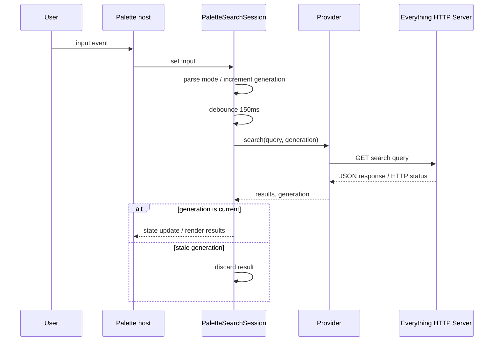

# My Palette 詳細仕様書

## 1. 文書の目的

本書は、PowerToys Command Palette に着想を得た Obsidian デスクトップ専用プラグイン「My Palette」を、既存プラグインのフォークではなくフルスクラッチで実装するための詳細仕様書である。

本書に記載した内容を v0.1.0 の実装基準・受け入れ基準とする。曖昧な場合は次の優先順位で判断する。

1. 安全に検索・実行できること
2. キーボードだけで素早く操作できること
3. Obsidian 標準の見た目と操作感に沿うこと
4. 後からモードを追加できること

> [!important] 確定事項
>
> - Another Quick Switcher、Quick Switcher++ などはフォークしない。
> - Everything 連携には公式 Everything 1.5 HTTP Server Plugin の JSON API を使用する。
> - Everything の検索構文は変換せず、`search` パラメーターへそのまま渡す。
> - 通常は `127.0.0.1` のみで待ち受け、HTTP Server 側のファイルダウンロード機能は無効にする。

## 2. プロダクト定義

### 2.1 コンセプト

1つのパレット、最小限のキー操作、プレフィックスによる明示的なモード切り替えを提供する。

### 2.2 対象環境

| 項目         | 要件                                                           |
| ------------ | -------------------------------------------------------------- |
| OS           | Windows 10 / 11                                                |
| Obsidian     | デスクトップ版のみ                                             |
| Everything   | Everything 1.5a と公式 HTTP Server Plugin が起動済みであること |
| 接続方式     | Everything HTTP Server JSON API                                |
| CPU          | x64 を第一対象とする                                           |
| ネットワーク | localhost 通信のみ。外部サービスへの接続は不要                 |

`manifest.json` の `isDesktopOnly` は `true` とする。モバイルではインストール・実行対象外とする。

### 2.3 プラグイン識別情報

| 項目            | 値                    |
| --------------- | --------------------- |
| Plugin ID       | `my-palette`          |
| Name            | `My Palette`          |
| Package name    | `obsidian-my-palette` |
| Initial version | `0.1.0`               |
| License         | MIT                   |

### 2.4 v0.1.0 のスコープ

- モーダル型パレットと右サイドバーの永続パレットビュー
- Vault ファイルモード
- Obsidian コマンドモード
- Everything モード
- 最小キーバインドとパレット内キーバインド設定
- 検索履歴ではなく、最近開いた Vault ファイルの表示
- Everything HTTP Server 接続診断
- 日本語・英語のファイル名とパス

### 2.5 v0.1.0 の対象外

- モバイル対応
- Everything 1.4 専用動作
- `es.exe`、Everything SDK、ETP との接続
- HTTP Server Plugin や Everything 本体の自動ダウンロード・同梱・自動起動
- Vault 全文検索、見出しジャンプ、ブロック検索
- Web 検索、電卓、レジストリ検索
- プレビューペイン
- マウス前提のコンテキストメニュー
- AQS / Switcher++ の設定移行

## 3. 用語

| 用語           | 意味                                                     |
| -------------- | -------------------------------------------------------- |
| パレット       | 本プラグインが表示する単一のモーダル画面                 |
| モード         | 入力の解釈、検索元、結果アクションの組み合わせ           |
| プレフィックス | モードを切り替える入力先頭文字列                         |
| クエリ         | プレフィックスを取り除き、前後空白を正規化した検索文字列 |
| Mod            | Windows では `Ctrl`                                      |
| 世代番号       | 非同期検索結果の新旧を判定する単調増加 ID                |

## 4. 起動と終了

### 4.1 Obsidian コマンド

プラグインは次のパレット起動コマンドを登録する。

| Command ID             | 表示名                                      | 動作                           |
| ---------------------- | ------------------------------------------- | ------------------------------ |
| `my-palette:open`      | `My Palette: Open palette`                  | パレットをファイルモードで開く |
| `my-palette:open-view` | `My Palette: Open palette in right sidebar` | 右サイドバーでパレットを開く   |
| `my-palette:open-new-view` | `My Palette: Open new palette in right sidebar` | 右サイドバーに新しいパレットを開く |

Obsidian 標準の「ホットキー」設定から、利用者がこのコマンドにグローバルホットキーを割り当てる。プラグイン側では衝突を避けるため、グローバルホットキーを既定割り当てしない。

### 4.3 永続パレットビュー

`my-palette:open-view` は `ItemView` を右サイドバーへ開く。入力欄を編集したまま候補を連続して切り替えられ、通常の本文ペインは検索ビューとは別に維持する。ビューのworkspace stateには入力、固定モード、検索元ノートを保存する。

`my-palette:open-new-view` は既存ビューを再利用せず、右サイドバーに新しい `ItemView` を作成する。各ビューは入力、検索セッション、検索元ノートを独立して保持する。既存の `PaletteView` のペインメニューから実行した場合は、そのビューの状態を引き継いで新しいビューを作成する。

主クリックは検索ビューを閉じず、起動時に記録した本文leafへ候補を開く。検索元ノート（link / backlink / Smart Connectionsの基準）はビューを開いた時点で固定する。

### 4.2 初期フォーカス

- コマンドから新規・既存ビューを開いたときは検索入力欄へフォーカスする。
- ワークスペース復元時は、エディターからフォーカスを奪わない。
- 前回の入力は引き継がず、毎回空入力で開始する。
- IME の未確定入力中は Enter やプレフィックス判定を実行しない。

### 4.3 終了条件

- `Escape`
- モーダル外側のクリック
- 結果アクションの正常完了
- Obsidian のワークスペース終了

終了時は保留中のデバウンスタイマーを解除し、実行中の HTTP リクエストを中断し、イベントリスナーを破棄する。

## 5. モード仕様

### 5.1 プレフィックス

| 優先順位 | 既定プレフィックス | モード               | 表示ラベル               |
| -------- | ------------------ | -------------------- | ------------------------ |
| 1        | `esdir`            | Everything directory | `Everything · Directory` |
| 2        | `es` / `e `        | Everything Vault     | `Everything · Vault`     |
| 3        | `>`                | Command              | `Commands`               |
| 4        | なし               | File                 | `Files`                  |

- `e ` は小文字 `e` と半角スペースの2文字である。
- プレフィックスは設定で変更可能とする。
- 判定は文字列先頭の完全一致とし、長いプレフィックスから評価する。
- 英字プレフィックスの大文字・小文字は区別しない。
- プレフィックス削除後は先頭空白だけを除去する。Everything 検索構文を壊さないため、クエリ内部の空白や記号は変更しない。
- 同一または包含関係で曖昧になるプレフィックスは設定保存時にエラーとする。
- どのプレフィックスにも一致しない場合は常に File モードとする。

例：

| 入力            | モード               | クエリ    |
| --------------- | -------------------- | --------- |
| 空              | File                 | 空        |
| `project`       | File                 | `project` |
| `>reload`       | Command              | `reload`  |
| `> reload`      | Command              | `reload`  |
| `es report`     | Everything Vault     | `report`  |
| `esdir ext:pdf` | Everything directory | `ext:pdf` |
| `example`       | File                 | `example` |

### 5.2 File モード

#### 検索対象

Vault 内の `TFile` を対象とする。フォルダー自体は結果に含めない。

1ファイルあたりの検索文字列は次を連結して構成する。

- 拡張子を除いたファイル名
- Vault ルートからの相対パス
- MetadataCache から取得できる aliases
- MetadataCache の inline tags と frontmatter の `tags`
- MetadataCache から取得できる先頭 H1

#### 空入力

Obsidian が保持する「最近開いたファイル」を検索候補へ渡し、`Activity` が有効な場合は最近開いた順を優先する。永続化したパレットの利用履歴は、最近開いた状態が同じ候補のタイブレークとして使う。存在しなくなったファイルは除外する。

#### 入力あり

- fuzzysort による fuzzy search を使用する。
- 空白で区切った語は AND 条件とし、すべての語に一致する項目だけを表示する。
- `|` で区切った条件は OR 条件とし、いずれかの条件に一致する項目を表示する。
- AND / OR 検索は File、Command、Link、Backlink、Bookmark、Smart Connections モードに適用する。Everything モードのクエリは Everything 自身の検索構文として無変換で渡す。
- 並び順は `Vault file search` 設定の `sortPriorities.blank`（空白時）または
  `sortPriorities.input`（入力時）を上から適用する。
- `@prior:asc` / `@prior:desc` は frontmatter の数値 `prior` を比較し、未設定値は最後に置く。
- `Filename prefix match` / `Filename fuzzy match` はファイル名、`Alias prefix match` / `Alias fuzzy match` は frontmatter の aliases、`Folder path match` はファイル名を除いた Vault 内の相対フォルダーパスを対象に比較する。
- `Activity` は最近開いたファイルの順序を先に比較し、同じ状態の候補では IndexedDB に保存した利用回数と最終利用時刻から計算したスコアを比較する。
- `#tag` で始まる検索はタグだけを対象とし、通常の検索語もタグに fuzzy match する。
- `Tag match` は検索に一致したタグ数を降順で比較する。
- `Match coverage` は、ファイル名・パス・個々の alias・個々の tag で一致した検索語の文字数を合計して降順で比較する。重複する値は1回だけ数え、OR 条件では合計が最大のブランチだけを使う。
- AND ブランチの全語がファイル名・パス・alias・tag のいずれかで連続一致する結果は、設定した fuzzy 系 priority より先に置く。
- `Aliases count` は frontmatter の `aliases` / `alias` の要素数を降順で比較する。
- 空入力では、検索語に依存する filename / alias / tag / folder path / coverage の match priorities を除外してから同じ設定を適用する。設定した priority がすべて同点の場合は Vault 内の相対パス昇順を使う。
- 最大50件を表示する。

#### 表示

- 主表示：拡張子を除いたファイル名
- 副表示：Vault ルートからの相対パス
- タグ表示：検索に一致したタグを2段目へ最大3件表示し、超過分は `+N` としてまとめる。行の tooltip に全件を表示する。
- アイコン：ファイル種別に応じた Obsidian 標準アイコン。判定不能時は `file`。

### 5.3 Command モード

#### 検索対象

現在の Obsidian で利用可能な全コマンドを対象とする。各項目はコマンド ID と表示名を保持する。

#### 並び順

- 空入力：プラグイン内に記録した最近実行コマンドを新しい順で最大20件、その後にコマンド名昇順。
- 入力あり：コマンド表示名に対する fuzzy score 降順。
- 同点の場合は最近実行した順、次に表示名昇順。
- 最大50件を表示する。

#### 表示と実行

- 主表示：コマンド表示名
- 副表示：コマンド ID
- アイコン：`terminal`
- Enter：コマンド ID を指定して Obsidian コマンドを実行する。
- 実行直前にパレットを閉じる。コマンドが新しいモーダルを開く場合のフォーカス競合を防ぐためである。

### 5.4 Everything モード

#### 検索スコープ

- `es`（および互換プレフィックス `e `）はVaultルート配下かつObsidianが`TFile`として認識しているファイルだけを返す。
- `es`は`userIgnoreFilters`対象と、相対パスのいずれかの区間が`.`で始まるファイルを除外する。
- `es`は設定した拡張子だけを対象とする。既定値は`md`, `canvas`, `base`。
- `esdir`はVaultの物理ディレクトリ配下にある全ファイルを対象とし、ignore・ドットファイル・拡張子フィルターを適用しない。
- `metadataCache.getFirstLinkpathDest()`は同名リンクの解決用であるため、検索結果の存在確認には使用しない。絶対パスをVault相対パスへ変換し、`vault.getAbstractFileByPath()`で`TFile`をO(1)参照する。

#### 前提条件

- Everything 1.5a と公式 HTTP Server Plugin が起動している。
- 設定した URL、ポート、任意のユーザー名・パスワードが HTTP Server 側と一致している。
- HTTP Server は通常 `127.0.0.1` で待ち受ける。

#### 空入力

空クエリでもスコープと拡張子条件だけで検索し、設定件数まで一覧を返す。Vaultルート外は取得しない。

#### 検索開始

- 1文字以上のクエリで検索可能とする。
- 入力変更から150ms後に検索する。
- 新しい入力があれば待機中の検索を取り消す。
- 既に HTTP リクエストが実行中なら中断し、新しい世代番号で検索する。
- 古い世代番号の応答・エラーは UI に反映しない。

#### HTTP リクエスト

設定 URL に対して GET を送り、次のクエリパラメーターを付与する。

```text
http://127.0.0.1:51361/?search=<query>&json=1&count=100&path_column=1&attributes_column=1
```

実装は Electron が提供する Node.js の `http` / `https` を使用し、次を厳守する。

- `URL` / `URLSearchParams` で値をエンコードし、Everything 検索構文自体は変更しない。
- `Accept: application/json` を送る。
- 認証情報が設定されている場合は HTTP Basic 認証を使用する。
- 応答サイズは 2 MiB を上限とする。
- プラグイン側の既定タイムアウトは30秒とする。`content:` のような低速検索を考慮する。
- URL は `http:` または `https:` のみ許可する。
- ブラウザーの CORS には依存しない。

パラメーターと設定値の対応は次のとおり。

| パラメーター        | 値           | 目的                                 |
| ------------------- | ------------ | ------------------------------------ |
| `search`            | 利用者クエリ | Everything 検索構文をそのまま渡す    |
| `json`              | `1`          | JSON 応答を要求                      |
| `count`             | 既定 `100`   | 返却件数を設定値（10〜500）で制限    |
| `path_column`       | `1`          | 親ディレクトリを取得                 |
| `attributes_column` | `1`          | ファイルとフォルダーの判別情報を取得 |

#### JSON 応答の解析

- ルートの `results` 配列を読み取る。
- 各項目の `path` と `name` から絶対パスを構築する。
- `type` が `folder`、または `attributes` に `D` が含まれる場合は folder、それ以外は file とする。
- `name` が文字列でない項目、絶対パスを構築できない項目は破棄する。
- `results` が空の場合は「結果なし」とする。
- 不正な JSON または未対応形式は制御されたエラーとして表示する。

#### 表示

- 主表示：basename
- 副表示：親ディレクトリの絶対パス
- アイコン：folder または file
- 並び順：Everything HTTP Server が返した順を保持する。
- 最大表示件数：設定値。既定100、許容範囲10〜500。

## 6. 結果アクション

### 6.1 既定アクション

| モード     | Enter                 | Mod+Enter        | Mod+Shift+Enter            |
| ---------- | --------------------- | ---------------- | -------------------------- |
| File       | 現在の leaf で開く    | 新しいタブで開く | 新しい左右分割で開く       |
| Command    | コマンド実行          | 割り当てなし     | 割り当てなし               |
| Everything | ObsidianまたはVS Code | Explorer で表示  | エディターへ絶対パスを挿入 |

永続パレットビューではEnter相当の主クリック後もビューを閉じず、追跡中の本文leafの内容だけを差し替える。中クリック、右クリックメニュー、検索履歴、行の表示形式はモーダルと共通である。

### 6.2 File アクション

- 現在の leaf で開く場合、既存 leaf がなければ新規 leaf を取得する。
- 新しいタブでは `getLeaf("tab")` 相当を使用する。
- 分割では `getLeaf("split", "vertical")` 相当を使用する。
- 開く直前に対象 `TFile` がまだ存在するか再確認する。

### 6.3 Everything アクション

#### Enterで開く

- `TFile`として認識できる通常ファイルはObsidianの現在のleafで開く。
- ignore対象、ドットファイル、その他Obsidianが認識しない物理ファイルはVS Codeで開く。
- VS Codeには`code --new-window <Vaultルート> <対象ファイル>`相当の引数を同時に渡す。
- 実行直前にパスの存在を確認する。

#### Explorer で表示

- ファイル：Explorer を開き、対象ファイルを選択する。
- フォルダー：対象フォルダーを Explorer で開く。

#### エディターへパスを挿入

- アクティブな Markdown エディターが存在する場合、カーソル位置へ絶対パスを挿入する。
- Windows パスは加工せず、例 `C:\Users\name\note.pdf` の形で挿入する。
- 選択範囲がある場合は置換する。
- アクティブエディターがない場合はパレットを閉じず、インラインエラーを表示する。

## 7. キーボード操作

### 7.1 既定キー

| アクション     | 既定キー           |
| -------------- | ------------------ |
| 次の結果       | `ArrowDown`        |
| 前の結果       | `ArrowUp`          |
| 既定アクション | `Enter`            |
| 代替アクション | `Ctrl+Enter`       |
| 第3アクション  | `Ctrl+Shift+Enter` |
| 閉じる         | `Escape`           |

- 一覧末尾で次へ進むと先頭へ循環する。先頭から前へ進むと末尾へ循環する。
- 結果が0件の場合、アクションキーは何もしない。
- IME composition 中のキーイベントは選択・実行に使わない。
- `Ctrl+P` / `Ctrl+N` は既定無効とする。

### 7.2 リバインド

- パレット内アクションのキー割り当てはプラグイン設定に保存する。
- 1アクションに最大2つのキーコードを登録できる。
- 修飾キーは `Ctrl`、`Shift`、`Alt`、`Meta` を正規順で保存する。
- `Escape` は安全な脱出手段として解除不可とする。
- 同一コンテキスト内で重複する割り当ては保存不可とし、衝突先を表示する。
- 文字入力を妨げる修飾キーなしの英数字・記号単独は割り当て不可とする。

## 8. 画面仕様

### 8.1 構成

```text
┌────────────────────────────────────────────────────────────┐
│ [mode icon] [search input.................................] │
├────────────────────────────────────────────────────────────┤
│ [icon] Primary label                         [action hint] │
│        Secondary label                                    │
│ [icon] Primary label                                      │
│        Secondary label                                    │
├────────────────────────────────────────────────────────────┤
│ Files / Commands / Everything          2 results   Esc close│
└────────────────────────────────────────────────────────────┘
```

### 8.2 レイアウト

- 幅：`min(720px, calc(100vw - 32px))`
- 最大高さ：`min(70vh, 640px)`
- 結果行：最小44px
- 主表示は1行、省略記号あり。
- 副表示は1行、省略記号あり。
- 選択行は Obsidian の interactive accent 色を使用する。
- 独自の固定色を避け、Obsidian CSS 変数を使用する。

### 8.3 UI 状態

| 状態       | 結果領域                                             |
| ---------- | ---------------------------------------------------- |
| idle       | File / Commandはrecent。Everythingは空検索結果を表示 |
| debouncing | 直前の結果を維持。フッターに待機表示は不要           |
| loading    | 直前の結果を維持し、入力欄右端に spinner             |
| success    | 新しい結果を表示し先頭を選択                         |
| empty      | `No results`                                         |
| error      | アイコン、短い原因、設定を開くボタン                 |

### 8.4 アクセシビリティ

- モーダルに `role="dialog"` と説明可能なラベルを付与する。
- 結果一覧に `role="listbox"`、行に `role="option"` を付与する。
- 選択行へ `aria-selected="true"` を付与する。
- 入力欄から `aria-activedescendant` で選択行を参照する。
- マウス hover だけに依存せず、フォーカスと選択を視覚表示する。
- OS の reduced motion を尊重する。

## 9. 設定仕様

### 9.1 Everything

| 設定キー                                 | 型       | 既定値                    | 制約                         |
| ---------------------------------------- | -------- | ------------------------- | ---------------------------- |
| `everything.httpUrl`                     | string   | `http://127.0.0.1:51361/` | HTTP(S) URL                  |
| `everything.username`                    | string   | `""`                      | 任意                         |
| `everything.password`                    | string   | `""`                      | 任意                         |
| `everything.maxResults`                  | number   | `100`                     | 10〜500                      |
| `everything.debounceMs`                  | number   | `150`                     | 50〜1000                     |
| `everything.requestTimeoutMs`            | number   | `30000`                   | 1000〜60000                  |
| `everything.vaultExtensions`             | string[] | `["md","canvas","base"]`  | Vault検索の対象拡張子        |

Everythingページには次を設ける。

- 接続: HTTP Server URL、任意のユーザー名・パスワード、接続テスト
- 検索: 最大結果件数、HTTPリクエストタイムアウト、検索デバウンス
- Vault検索: 対象拡張子。`esdir` はVault配下の全ファイルを対象とする

パスワードはプラグインのローカル `data.json` に保存されることを設定画面に明記する。

#### 接続テスト

固定クエリ `__my_palette_connection_test__` を最大1件で実行する。HTTP 2xx と正しい JSON 応答が得られれば、結果が0件でも接続成功とする。

### 9.2 Search history

検索履歴はモード共通で次の設定を持つ。

| 設定キー                   | 型      | 既定値 | 説明                 |
| -------------------------- | ------- | ------ | -------------------- |
| `searchHistory.enabled`    | boolean | `true` | 検索履歴を有効にする |
| `searchHistory.daysToKeep` | number  | `0`    | 保持日数。0は無期限  |

### 9.3 Mode prefixes

| 設定キー                  | 既定値 |
| ------------------------- | ------ |
| `prefixes.command`        | `">"`  |
| `prefixes.everything`     | `"e "` |
| `prefixes.includeIgnored` | `"i "` |

組み込みprefixとして `o `（現在ノートから出るリンク）、`b `（現在ノートへ入るリンク）、
`bk `（ブックマーク）、`sc `（Smart Connections）、`esdir `（Everythingのdirectory検索）を予約する。
`i `（Excluded files）はFile検索専用で、関連検索prefixとは組み合わせない。

空文字、改行、NUL、File モードとの区別が不能な値は保存できない。

### 9.4 Keybindings

キーバインドはObsidianのコマンド設定へ委譲し、プラグイン独自の設定データとして保存しない。

### 9.5 Settings screen layout

設定画面は保存データの階層ではなく、利用目的で3ページに分ける。Obsidianの設定は別ウィンドウで開くため、少数の設定だけを別ページにせず、関連する補助設定を主目的のページへまとめる。各ページの説明には、ページ内で変更できる設定の種類を列挙する。

| ページ              | 内容                                                                              |
| ------------------- | --------------------------------------------------------------------------------- |
| `Palette`           | プレフィックス、最後の入力の復元、検索履歴、Vault外Markdownの開き方、診断設定     |
| `Vault file search` | 除外フォルダ、除外ノートのインデックス再構築、Vaultファイルの検索結果の並び順       |
| `Everything`        | Everything 1.5の接続・認証、結果件数、対象拡張子、検索タイミング、Vault検索の詳細 |

## 10. データモデル

```ts
type PaletteMode = "file" | "command" | "everything";

interface ParsedInput {
	raw: string;
	mode: PaletteMode;
	query: string;
}

interface BaseResult {
	id: string;
	mode: PaletteMode;
	primary: string;
	secondary: string;
	icon: string;
}

interface FileResult extends BaseResult {
	mode: "file";
	vaultPath: string;
	matchedTags?: string[];
}

interface CommandResult extends BaseResult {
	mode: "command";
	commandId: string;
}

interface EverythingResult extends BaseResult {
	mode: "everything";
	absolutePath: string;
	kind: "file" | "folder";
	attributes: string;
}

interface MyPaletteSettings {
	schemaVersion: 16;
	showLog: boolean;
	rememberLastInput: boolean;
	searchHistory: {
		enabled: boolean;
		addDelayMs: number;
		daysToKeep: number;
	};
	prefixes: {
		command: string;
		everything: string;
	};
	file: {
		sortPriorities: { blank: string[]; input: string[] };
	};
	everything: {
		httpUrl: string;
		username: string;
		password: string;
		maxResults: number;
		debounceMs: number;
		requestTimeoutMs: number;
		vaultExtensions: string[];
	};
}
```

- 設定には `schemaVersion` を必須とする。
- 未知のキーは読み込み時に無視する。
- 欠損キーは既定値で補完する。
- 型・範囲が不正な値は項目単位で既定値へ戻し、プラグイン全体のロードを失敗させない。
- 最近実行コマンドは最大20 ID。存在しない ID は表示時に除外する。
- 最近実行コマンドのIDは Vault 単位の IndexedDB に保存し、設定の `data.json` にはIDを保存しない。
- 既存の `data.json` にある最近実行コマンドIDは、初回起動時に IndexedDB へ移行する。IndexedDB が利用できない場合はIDを `data.json` の一時的なフォールバックとして保持する。
- `rememberLastInput` が有効な場合、モードごとの最後の入力を Obsidian の実行中だけ保持する。
- 検索履歴は検索モード・Everything の検索範囲ごとに分類し、プレフィックスを除いた検索語、回数、最終検索日時を Vault 単位の IndexedDB へ永続化する。設定の `data.json` には履歴エントリを保存しない。
- 既存の `data.json` にある履歴エントリは、初回起動時に IndexedDB へ移行する。IndexedDB が利用できない場合は履歴を `data.json` の一時的なフォールバックとして保持し、次回起動時に再試行する。
- 検索結果リストへフォーカスが移ったときに履歴へ追加する。検索欄のblurや入力停止後の経過時間だけでは追加しない。
- 大文字小文字だけが異なる入力は同じ履歴項目として扱い、最新の表記と回数を保持する。
- 入力欄右端の履歴ボタンまたは `Ctrl+R` で現在のモードの検索履歴を表示し、項目を選ぶと現在のプレフィックス付き入力へ復元する。

## 11. アーキテクチャ

### 11.1 モジュール構成

```text
src/
├── main.ts
├── settings.ts
├── app/
│   ├── createPaletteProviders.ts
│   ├── openExternalMarkdown.ts
│   ├── registerCommands.ts
│   └── registerEvents.ts
├── commands/
│   ├── mocRelateds.ts
│   └── mocRelatedsCore.ts
├── ignored-notes/
│   ├── ignoredNoteIndex.ts
│   ├── ignoredNoteMaterializer.ts
│   ├── ignoredPathMatching.ts
│   └── ignoredPaths.ts
├── palette/
│   ├── PaletteModal.ts
│   ├── PaletteSearchSession.ts
│   ├── backgroundResultActions.ts
│   ├── executePaletteResult.ts
│   ├── inputParser.ts
│   ├── MoveFileModal.ts
│   ├── openTargets.ts
│   ├── resultPresentation.ts
│   ├── resultActions.ts
│   ├── searchHistory.ts
│   └── searchHistoryStore.ts
├── platform/
│   ├── desktopAdapter.ts
│   ├── pathClipboard.ts
│   └── vscode.ts
├── search/
│   ├── PaletteProvider.ts
│   ├── bookmark/
│   │   └── BookmarkProvider.ts
│   ├── command/
│   │   ├── CommandProvider.ts
│   │   ├── commandSorting.ts
│   │   └── recentCommandStore.ts
│   ├── everything/
│   │   ├── EverythingHttpClient.ts
│   │   ├── EverythingProvider.ts
│   │   └── everythingQuery.ts
│   ├── file/
│   │   ├── FileProvider.ts
│   │   └── fileSorting.ts
│   ├── related/
│   │   └── RelatedFileProvider.ts
│   └── smart/
│       └── SmartConnectionProvider.ts
├── model/
│   ├── results.ts
│   └── settings.ts
├── settings/
│   ├── mergeSettings.ts
│   ├── settingsStore.ts
│   └── settingTab.ts
├── shared/
│   ├── externalFiles.ts
│   └── pathDisplay.ts
├── ui/
│   ├── baseSuggestModal.ts
│   ├── searchHistorySuggest.ts
│   ├── selectionModal.ts
│   └── suggestionPanel.ts
└── views/
    ├── ExternalMarkdownView.ts
    └── PaletteView.ts
```

### 11.2 責務

| コンポーネント               | 責務                                                                       |
| ---------------------------- | -------------------------------------------------------------------------- |
| `main.ts`                    | 設定ロード、Pluginライフサイクル、依存関係の組み立て                       |
| `app/registerCommands`       | Obsidianコマンドの登録と実行条件                                           |
| `app/registerEvents`         | ViewとVaultイベントの登録                                                  |
| `app/createPaletteProviders` | Providerの生成とモードregistryの構築                                       |
| `PaletteSearchSession`       | 入力解析、Provider検索、世代番号、キャンセル、履歴コミット                 |
| `SuggestionPanel`            | Modal / ItemView共通の入力、候補行、選択、ポインター操作                   |
| `executePaletteResult`       | 結果モードごとのアクション振り分けとホスト差分の吸収                       |
| `PaletteModal`               | モーダルのライフサイクル、フォーカス、閉じる挙動                           |
| `PaletteView`                | 右サイドバーの永続パレット、本文leaf追跡、workspace state                  |
| `resultPresentation`         | 検索結果の表示形式とパスコピー対象の決定                                   |
| `inputParser`                | プレフィックス検出とクエリ抽出。副作用なし                                 |
| Provider                     | モード別検索。UI 要素を直接操作しない                                      |
| `EverythingHttpClient`       | URL構築、認証、リクエスト中断、タイムアウト、JSON解析                      |
| `resultActions`              | モード別アクション実行                                                     |
| `settings/mergeSettings`     | 永続化データの検証と既定値の補完                                           |
| `settings/settingsStore`     | `data.json` のロード・保存と旧履歴データの移行準備                         |
| `SearchHistoryStore`         | Vault単位のIndexedDB保存、履歴の読み書き、削除、フォールバック             |
| `RecentCommandStore`         | Vault単位のIndexedDB保存、最近実行コマンドの並び替え、削除、フォールバック |
| `settings/settingTab`        | 設定 UI と入力値の反映                                                     |
| `IgnoredNoteIndex`           | 除外ファイルを検索可能にする再構築可能なキャッシュ                         |
| `ExternalMarkdownView`       | Vault外または除外されたMarkdownの読み取り専用表示                          |

### 11.3 非同期検索フロー



Provider は `AbortSignal` を受け取れる契約にする。File / Command は同期処理でも同じ Promise ベースのインターフェースを実装する。

## 12. エラー処理

### 12.1 HTTP エラー

| 条件                 | ユーザー表示                                                      |
| -------------------- | ----------------------------------------------------------------- |
| HTTP 2xx             | 結果または `No results`                                           |
| 401                  | `Everything HTTP authentication failed.`                          |
| 接続拒否             | `Everything HTTP Server is not running or the port is incorrect.` |
| タイムアウト         | `Everything HTTP search timed out.`                               |
| 2xx / 401 以外       | HTTP ステータスを含む短いエラー                                   |
| 不正 JSON / 形式違い | 応答形式エラー                                                    |
| 2 MiB 超過           | 応答サイズ上限エラー                                              |

### 12.2 その他

| 条件             | 挙動                                  |
| ---------------- | ------------------------------------- |
| URL 未設定・不正 | 設定を確認するエラー                  |
| Abort            | UI にエラー表示せず、新しい検索を優先 |
| 対象ファイル消失 | パレットを閉じず、行を除去して通知    |
| コマンド消失     | パレットを閉じず、一覧を再取得        |

stderr の生値やローカル絶対パスは通常 UI に全面表示しない。`showLog` が有効な場合だけ開発者コンソールへ詳細を記録する。

## 13. セキュリティとプライバシー

- 既定では `127.0.0.1` の Everything HTTP Server とのみ通信する。
- 検索結果そのものは永続化せず、検索語とファイル利用履歴だけを Vault 単位のローカル IndexedDB に保存する。
- telemetry を実装しない。
- HTTP Server 側のファイルダウンロード機能は無効を推奨する。
- LAN 公開する場合は認証とファイアウォール設定を利用者の責任で行う。
- 認証パスワードは Obsidian Vault のプラグイン `data.json` に平文保存されるため、共有 Vault では使用しない。
- 検索履歴とファイル利用履歴は Vault 識別子で分離したローカル IndexedDB に保存し、外部サービスへ送信しない。
- 検索結果パスをアクション直前に再検証する。
- Everything の検索構文は URL パラメーターとしてエンコードし、OS シェル構文としては一切解釈しない。
- プラグインは管理者権限への昇格を要求・実行しない。

## 14. 性能要件

計測環境差を考慮し、以下は通常規模の Vault（10,000ファイル以下）を基準とする。

| 操作                            | 目標                      |
| ------------------------------- | ------------------------- |
| パレット初回表示                | コマンド実行から100ms以内 |
| File / Command 結果更新         | 入力から50ms以内          |
| Everything 応答後の UI 反映     | JSON 受信完了から50ms以内 |
| 入力中のメインスレッド blocking | 1タスク16ms未満           |
| DOM に同時生成する結果行        | 最大100                   |

- MetadataCache の alias / H1 検索文字列はパレット起動時に全ファイル分を毎回再構築せず、Vault / metadata イベントで更新するキャッシュとする。
- File / Command の検索は必要なら小分けにするが、v0.1.0 では Web Worker を導入しない。
- Everything 結果件数は HTTP の `count` でも必ず制限する。

## 15. テスト仕様

### 15.1 Unit tests

最低限、次を Vitest で自動化する。

- プレフィックスの通常判定、大文字判定、最長一致、重複検証
- `> reload`、`es report`、`esdir ext:pdf`のクエリ抽出とスコープ判定
- HTTP URL パラメーターで検索構文と日本語が正しくエンコードされること
- Windows パスの大文字・小文字を無視した重複排除
- `attributes` による file / folder 判定
- HTTP ステータス・接続拒否・不正 JSON から UI エラーへの変換
- 世代番号が古い結果を破棄すること
- 設定の欠損補完、範囲補正、schema migration
- キーバインド衝突検出と IME composition の無視

### 15.2 Integration tests

`EverythingHttpClient` の HTTP Server を mock 化して次を確認する。

- `json=1`、`count`、`path_column=1`、`attributes_column=1` が付く。
- クエリに `content:`, `& | > < "`、日本語が含まれても検索構文が保持される。
- timeout と Abort でリクエストが停止する。
- Basic 認証と HTTP エラーを適切に処理する。
- 2 MiB 超過時に制御されたエラーとなる。

### 15.3 Manual acceptance tests

Windows 11、Everything 1.5a 実機、英数字・日本語・空白を含むパスで確認する。

1. パレットを開くと100ms程度で入力可能になる。
2. 空入力で最近開いた Vault ファイルが表示される。
3. ファイル名・パス・alias・H1 の各条件で目的ファイルを絞り込める。
4. `>` で Command モードへ即時切り替わる。
5. コマンド実行後に対象コマンドが recent 上位へ移動する。
6. `es`だけでも既定拡張子のVaultファイル一覧が表示される。
7. `es 日本語`でignore・ドットパスを除くObsidian有効ファイルだけが表示される。
8. `esdir`だけでもVault物理ディレクトリ以下の全ファイルが表示される。
9. Everything の検索構文 `content:`, `ext:`, `path:`, `folder:` がそのまま機能する。
10. 通常ファイルはObsidian、ignore対象などはVaultルートと対象パスを渡してVS Codeで開く。
11. 高速連続入力しても古い検索結果へ巻き戻らない。
12. Everything HTTP Server を終了すると接続案内が出る。
13. URL または認証情報が不正でも Obsidian 自体は正常に動作し続ける。
14. 検索語に URL / shell 記号を含めても構文が壊れたり別コマンドが実行されたりしない。
15. ダーク・ライト両テーマで選択行と副表示を判別できる。
16. IME 変換確定の Enter で誤実行しない。
17. `Open palette in right sidebar` で右サイドバーに検索状態を保持できる。
18. 右サイドバーの主クリックで検索ビューを閉じず、本文leafだけを差し替えられる。
19. 右サイドバーをアクティブにした状態でも、本文leafへの主クリック、中クリック、右クリック操作が壊れない。
20. 右サイドバーを閉じて再表示しても入力、固定モード、検索元が復元される。

Obsidian 上での最終確認手順は次とする。

```powershell
vp check
vp test
vp build
obsidian plugin:reload id=my-palette
obsidian dev:errors
obsidian dev:console level=error
obsidian dev:screenshot path=my-palette-verification.png
```

## 16. 完了条件

v0.1.0 は以下をすべて満たした時点で完成とする。

- 本書の3モードが実装されている。
- 公式 Everything HTTP Server JSON API を通じて検索している。
- 手動受け入れテストがすべて成功している。
- `vp check`、`vp test`、`vp build` が成功している。
- Obsidian の `dev:errors` と error console に本プラグイン由来のエラーがない。
- ダーク・ライトテーマで視覚確認済みである。
- `manifest.json`、`README.md`、設定画面が実装内容と一致している。
- リリース成果物に `main.js`、`manifest.json`、`styles.css` が含まれる。

## 17. 実装順序

| Phase | 内容                                        | 出口条件                           |
| ----- | ------------------------------------------- | ---------------------------------- |
| 1     | Plugin ID、manifest、設定モデル、基本 Modal | 空のパレットを開閉できる           |
| 2     | inputParser、FileProvider、CommandProvider  | File / Command が実用可能          |
| 3     | EverythingHttpClient、EverythingProvider    | Everything 検索と3アクションが動く |
| 4     | キー設定、接続診断、エラー UI               | 設定から自己診断できる             |
| 5     | 自動テスト、実機 QA、README                 | 完了条件を満たす                   |

## 18. 将来拡張の境界

将来モードは `PaletteProvider` を追加し、プレフィックス設定と結果アクションを登録する形で拡張する。v0.1.0 の入力・結果 UI を作り直さずに次を追加可能な構造とする。

- `/` Vault 全文検索
- `=` 電卓
- `?` Web 検索
- 見出し・ブロックジャンプ
- プレビュー
- ピン留め結果

HTTP Server のホストやポートが変わっても `everything.httpUrl` の変更だけで追従できるようにする。接続方式は、別途仕様変更しない限り公式 HTTP Server JSON API を維持する。

## 19. 参考資料

- [voidtools: Everything Plugins](https://www.voidtools.com/support/everything/plugins/)
- [voidtools: Everything HTTP Server](https://www.voidtools.com/en-us/support/everything/http/)
- [voidtools: Everything Search Syntax](https://www.voidtools.com/en-us/support/everything/searching/)
- [Obsidian Developer Documentation](https://docs.obsidian.md/)
